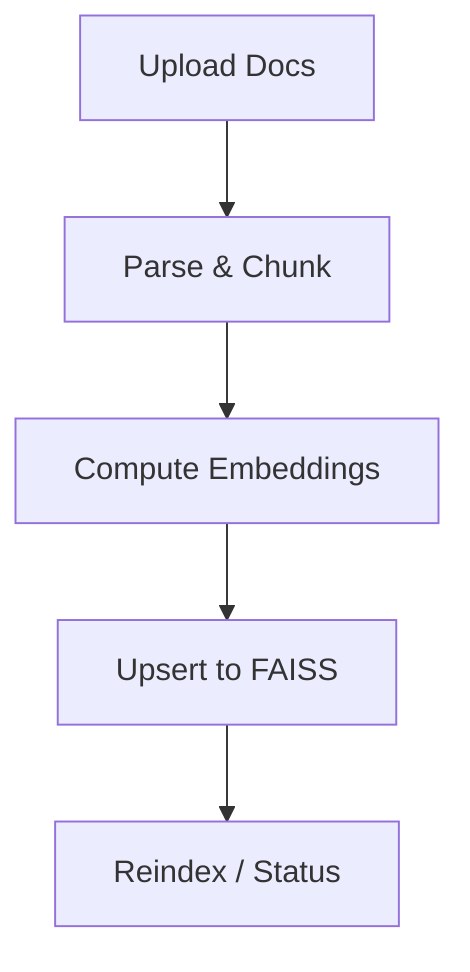

# 🧠 Tamil AI Voice Assistant (All-in-One Local App)

**Framework:** LangChain + LangGraph
**Mode:** Fully Offline
**App Type:** Single Application (Admin Dashboard + Voice Assistant)
**Goal:** Build a seamless Tamil Google Assistant–like AI that works offline, with RAG managed via Admin Dashboard.

---

## 🚀 Overview

This system combines:

* A **Tamil voice-based assistant** that listens, understands, and replies in Tamil.
* A **secure admin dashboard** that manages documents for RAG (Retrieval-Augmented Generation).
* A **local backend** that runs all models offline (LLM, STT, TTS, Embeddings, VectorDB).
* A **unified desktop app** (Electron/Tauri) bundling both frontend + backend.

Everything runs **100% locally** with **no internet dependency**.

---

## 🧩 Core Architecture

**Tech Layers:**

| Layer            | Technology                          |
| ---------------- | ----------------------------------- |
| UI               | React + Tailwind + Vite (Web)       |
| Shell            | Electron / Tauri                    |
| Backend API      | FastAPI                             |
| AI Orchestration | LangChain + LangGraph               |
| LLM              | Llama / Tamil-LLaMA (GGUF)          |
| Embeddings       | SentenceTransformers (multilingual) |
| Vector Store     | FAISS (local)                       |
| STT              | Faster-Whisper / VOSK Tamil model   |
| TTS              | Coqui TTS (MMS Tamil)               |
| Wake Word        | openWakeWord                        |
| Storage          | Local FS (SQLite/JSON/FAISS)        |

---

## 🧠 LangGraph Structure

### **1️⃣ IngestGraph (Admin)**



### **2️⃣ ChatGraph (User Voice)**

```mermaid
flowchart TD
A[Wake Word Detected] --> B[STT (Tamil Speech)]
B --> C[RAG Retrieve (LangChain)]
C --> D[Prompt + LLM Inference]
D --> E[TTS (Tamil Reply)]
E --> F[Voice Playback]
```

---

## 🗂️ Folder Structure

```
tamil-voice-assistant/
├─ app/
│  ├─ electron/              # Electron main process
│  └─ web/                   # React + Vite frontend
├─ backend/
│  ├─ graphs/
│  │  ├─ ingest_graph.py
│  │  └─ chat_graph.py
│  ├─ rag/
│  │  ├─ loaders.py
│  │  ├─ embeddings.py
│  │  ├─ vectorstore.py
│  │  ├─ prompts.py
│  │  └─ chunking.py
│  ├─ speech/
│  │  ├─ stt.py
│  │  ├─ tts.py
│  │  └─ wakeword.py
│  ├─ models/
│  │  ├─ llm_local.py
│  │  └─ download_models.py
│  ├─ api/
│  │  ├─ admin.py
│  │  └─ chat.py
│  ├─ main.py
│  └─ settings.py
├─ data/
│  ├─ docs/
│  ├─ faiss/
│  ├─ chunks/
│  └─ logs/
└─ models/
   ├─ llm/
   ├─ stt/
   ├─ tts/
```

---

## ⚙️ Backend Setup (Python)

### **requirements.txt**

```txt
fastapi==0.115.*
uvicorn[standard]==0.30.*
langchain==0.2.*
langgraph==0.2.*
langchain-community==0.2.*
sentence-transformers==3.*
faiss-cpu==1.8.*
ctransformers==0.2.*
faster-whisper==1.0
openwakeword==0.6.*
TTS==0.22.*
unstructured==0.15.*
pypdf==4.*
python-multipart==0.0.9
```

---

## 🧱 Core LangGraph Nodes

### **IngestGraph (Admin RAG)**

```python
class IngestState(TypedDict):
    files: List[str]
    chunks: List[str]
    status: str

def load_node(state):
    docs = load_docs(state["files"])
    return {"chunks": chunk_docs(docs), "status": "loaded"}

def embed_node(state):
    emb = get_embeddings()
    vs  = load_or_create_index(emb)
    vs.add_texts(state["chunks"])
    persist_index(vs)
    return {"status": "indexed"}
```

---

### **ChatGraph (User Voice)**

```python
class ChatState(TypedDict):
    wav_path: str
    question: str
    answer: str
    tts_path: Optional[str]

def stt_node(state):
    text = tamil_transcribe(state["wav_path"])
    return {"question": text}

def rag_node(state):
    vs = load_or_create_index(get_embeddings())
    docs = vs.as_retriever(k=4).get_relevant_documents(state["question"])
    llm = get_llm()
    prompt = rag_prompt()
    chain = LLMChain(llm=llm, prompt=prompt)
    context = "\n\n".join([d.page_content for d in docs])
    output = chain.invoke({"question": state["question"], "context": context})
    return {"answer": output["text"]}

def tts_node(state):
    path = "data/out/answer.wav"
    speak_tamil(state["answer"], path)
    return {"tts_path": path}
```

---

## 🗂️ Admin Dashboard (Frontend)

**Features**

* Login (optional)
* Upload documents
* Show index stats (chunk count, model used)
* Reindex button
* Logs viewer (query latency, retrieved sources)

---

## 👨‍💻 FastAPI Endpoints

| Endpoint             | Description                                |
| -------------------- | ------------------------------------------ |
| `POST /admin/upload` | Upload & index documents                   |
| `GET /admin/status`  | Check ingestion progress                   |
| `POST /chat/voice`   | Upload recorded WAV, get Tamil voice reply |
| `GET /health`        | Backend status for Electron                |

---

## 🖛️ Build Steps

```bash
# 1️⃣ Setup
python3 -m venv .venv && source .venv/bin/activate
pip install -r requirements.txt

# 2️⃣ Download offline models
python backend/models/download_models.py

# 3️⃣ Run backend
uvicorn backend.main:app --reload

# 4️⃣ Run React frontend
cd app/web && npm i && npm run dev

# 5️⃣ Build Electron app
cd app/electron && npm run build
```

---

## 🧠 LangChain + LangGraph Advantages

* ✅ **LangGraph:** Persistent conversational state, modular node execution.
* ✅ **LangChain:** Simplifies RAG pipelines and LLM integration.
* ✅ **Offline:** All compute on-device.
* ✅ **Composable:** Replace or upgrade STT, TTS, or LLM models easily.

---

## 🔒 Security & Privacy

* Docs never leave device
* No telemetry or analytics
* Optional local admin auth (JWT/SQLite)
* Sandboxed model access

---

## 🧰 Recommended Models

| Type       | Model                      | Size  | Notes                      |
| ---------- | -------------------------- | ----- | -------------------------- |
| LLM        | Tamil-LLaMA 7B GGUF        | 4-bit | Tamil chat-tuned           |
| Embeddings | SentenceTransformer MiniLM | 400MB | Fast multilingual          |
| STT        | Faster-Whisper (medium)    | 1.4GB | Tamil ASR                  |
| TTS        | Coqui MMS Tamil            | 500MB | Natural female Tamil voice |
| Wake Word  | openWakeWord custom        | 20MB  | “Vanakkam Assistant”       |

---

## 🧪 Testing Checklist

* [ ] Voice accuracy > 90%
* [ ] Offline inference verified
* [ ] <3s latency end-to-end
* [ ] Handles PDFs & DOCX
* [ ] Tamil responses natural

---

## 🦯 Next Steps

1. [ ] Add session memory (LangGraph state)
2. [ ] Add voice mode toggle in UI
3. [ ] Implement local auth for admin
4. [ ] Add hotword training script
5. [ ] Package `.exe` or `.deb` bundle

---

**Created for:** *GetSetAI / TamilTalkRAG Initiative*
**Purpose:** *Offline Confidential AI Assistant for Enterprises (Tamil-first)*
